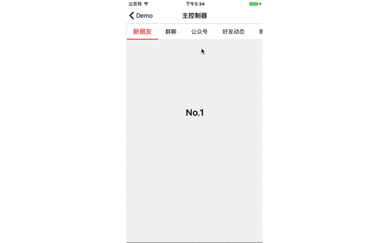

# MenuComponent

[](https://raw.githubusercontent.com/CheeryLau/MenuComponent/master/LICENSE)&nbsp;
[](https://cocoapods.org/pods/MenuComponent)&nbsp;
[](https://cocoapods.org/pods/MenuComponent)&nbsp;

`MenuComponent`是一个多功能滑动菜单控件，实现各子控制器的滚动展示，支持点击、左右滑动以及分级，标签可以是纯文字也可以是图片加文字。



## 安装 [CocoaPods]

1. `pod "MenuComponent"`;
2. `pod install` / `pod update`;
3. `#import <MenuComponent/MenuTabBarController.h>`.

## 使用说明

本组件，包含：`MenuTabBarController`和`MenuTabBar`，两者均可单独使用。其中`MenuTabBarController`通过使用`addChildViewController`将各子控制器加在同一父控制器中，通过点击标签按钮或滑动，实现各子控制器的切换。部分UI可通过以下属性自行设置。

顶部菜单类型:

```objc
// 枚举
typedef NS_ENUM(NSInteger, MenuTabBarType) {
    MenuTabBarTypeNormal,       //同级：仅有文字，宽度由文字决定
    MenuTabBarTypeAverage,      //同级：仅有文字，宽度均分
    MenuTabBarTypeArrow,        //分级：可逐级点击
    MenuTabBarTypeImage         //同级：图在上文字在下，宽度均分
};
```

MenuTabBarController属性：
  
```objc
// 代理
@property (nonatomic,assign) id<MenuTabBarControllerDelegate> delegate;
// 类型
@property (nonatomic,assign) MenuTabBarType tabBarType;
// 子控制器是否可以滑动 [默认NO]
@property (nonatomic,assign) BOOL scrollEnabled;
// 点击切换是否有动画 [默认NO]
@property (nonatomic,assign) BOOL scrollAnimation;
// 点击文字是否变大 [默认NO]
@property (nonatomic,assign) BOOL enlargeEnabled;
// 顶部菜单高度 [默认：kMaxMenuHeight]
@property (nonatomic,assign) CGFloat tabBarHeight;
// 字体
@property (nonatomic,strong) UIFont *font;
// 标签文本颜色
@property (nonatomic,strong) UIColor *textColor;
// 被选中标签的文本颜色
@property (nonatomic,strong) UIColor *indicatorTextColor;
// 被选中后标示线颜色
@property (nonatomic,strong) UIColor *indicatorLineColor;
// 文字数组
@property (nonatomic,strong) NSArray *titleArray;
// 图片名称数组
@property (nonatomic,strong) NSArray *imageNameArray;
// 子控制器数组
@property (nonatomic,strong) NSArray *subViewControllers;
// MenuTabBarTypeArrow类型下的arrow图片名称
@property (nonatomic,copy) NSString *arrowImageName;
//当前选择的Index
@property (nonatomic,assign,readonly) NSInteger currentIndex;

// 外部接口

// 更新菜单
- (void)updateData;
// 设置父控制器
- (void)setParentController:(UIViewController *)viewController;
```

具体使用如下：

```objc
MenuTabBarController *tabVC = [[MenuTabBarController alloc] init];
tabVC.delegate = self;
tabVC.scrollEnabled = YES;
tabVC.scrollAnimation = NO;
tabVC.font = [UIFont systemFontOfSize:15.0];
tabVC.textColor = [UIColor blackColor];
tabVC.indicatorTextColor = [UIColor redColor];
tabVC.indicatorLineColor = [UIColor redColor];
tabVC.titleArray = @[@"新朋友",@"群聊",@"公众号"];
tabVC.imageNameArray = @[@"item_0",@"item_1",@"item_2"];
tabVC.subViewControllers = @[firstVC,seconVC,thirdVC];
[tabVC setParentController:self];
```

```objc
#pragma mark - MenuTabBarControllerDelegate
- (void)tabBarController:(MenuTabBarController *)tabBarController didSelectAtIndex:(NSInteger)index
{
    NSLog(@"点击Index：%d",index);
}
```

## END

有问题可以联系我【QQ:1539901764 要备注来源哦】，如果这个工具对你有些帮助，请给我一个star、watch。O(∩_∩)O谢谢

